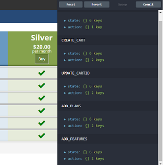

# Angular Quick Starter 


> An Angular quick starter kit featuring all the goodies from the base project [Angular Webpack Starter] (https://github.com/AngularClass/angular-starter) 

> This has been enhanced with the learning and experiences implementing Angular based solutions

* Redux Support : Added NGRX and NGRX LocalStorageSync and setup the infrastructure for the same
* Added NGRX store utilities
* Get the current snapshot of the store
* intl polyfill for i18n Angular 2/4 APIs / pipes
* profile based environment parameters infrastructure - dev, test, prod
* Json-server infrastructure
* Utilities added - Jquery, lodash
* Added an end-to-end reference implementation with product view , selection ,cart view and registration form (with validation) , lazy loading, page guards, mock API access , Reactive templates and forms using Observables, Modules creation , Smart and Dump Component separation, routing, conditional templates, Data Model, Redux Reducers , Effects etc.
* This will help the developers have a reference of the "right way of implementing " - First time right
* UI CSS/Styling
* Bootstrap 3/JQuery support
* A reference implementation for shopping cart
* Session Timeout (Set a timer based on an expiry date/time and get a warning/alert on completion)
* CMS integration (headless) with build time template updates with CMS content
* End to End shopping experience workflow Products/Pricing/Cart/Registration Form/Invoice based on the redux pattern , using highly performant Observables 

### Reference Usecase

* An online subscription plan which the user can view the features and the pricing details , select one or more plans and add it to the cart , view and modify the cart contents and then proceed to register his details before checkout.
* Catalog - An online product plan with a set of features and related pricing 
* Product , Features , Plans
* User
1) Views the plans , features and then selects one or more plans and adds them to the cart
2) The cart can be viewed and modified
3) Once the cart has items added the user can proceed to register himself and adding address details
4) On completion an invoice is generated
* Patterns : Modules, LazyLoading, Web Components, Smart Components, Redux Store , Reducers, Page Routing Guards, Reactive Forms, API Access, Event Emitters, Observables, Conditional Templates, i18n Pipes, Validators

### Quick start
**Make sure you have Node version >= 6.0 and NPM >= 3**

```bash
# clone our repo
# --depth 1 removes all but one .git commit history
git clone --depth 1 https://github.com/ng2-dev/angular-quick-starter.git

# change directory to our repo
cd angular-quick-starter

# install the repo with npm
npm install

# start the server
## start the json-server

```
npm run json-server
```
## start the app server

```
npm start
```

# use Hot Module Replacement
npm run server:dev:hmr

```
go to [http://0.0.0.0:3000](http://0.0.0.0:3000) or [http://localhost:3000](http://localhost:3000) in your browser

### Angular Material 2
Check out the dev-material branch for the angular material 2 sample


# Getting Started
## Dependencies
What you need to run this app:
* `node` and `npm` (`brew install node`)
* Ensure you're running the latest versions Node `v6.x.x`+ (or `v7.x.x`) and NPM `3.x.x`+

> If you have `nvm` installed, which is highly recommended (`brew install nvm`) you can do a `nvm install --lts && nvm use` in `$` to run with the latest Node LTS. You can also have this `zsh` done for you [automatically](https://github.com/creationix/nvm#calling-nvm-use-automatically-in-a-directory-with-a-nvmrc-file)

Once you have those, you should install these globals with `npm install --global`:
* `webpack` (`npm install --global webpack`)
* `webpack-dev-server` (`npm install --global webpack-dev-server`)
* `karma` (`npm install --global karma-cli`)
* `protractor` (`npm install --global protractor`)
* `typescript` (`npm install --global typescript`)

## Installing
* `fork` this repo
* `clone` your fork
* `npm install webpack-dev-server rimraf webpack -g` to install required global dependencies
* `npm install` to install all dependencies or `yarn`
* `npm run server` to start the dev server in another tab

## Running the app
After you have installed all dependencies you can now run the app. Start the json-server which provides the product catalog APIs for the application Run `npm run json-server` . This will run on port 3001. Run `npm run server` to start a local server using `webpack-dev-server` which will watch, build (in-memory), and reload for you. The port will be displayed to you as `http://0.0.0.0:3000` (or if you prefer IPv6, if you're using `express` server, then it's `http://[::1]:3000/`).

### server
```bash
# development
npm run server
# production
npm run build:prod
npm run server:prod
```

## Other commands

### build files
```bash
# development
npm run build:dev
# production (jit)
npm run build:prod
# AoT
npm run build:aot
```

### hot module replacement
```bash
npm run server:dev:hmr
```

### watch and build files
```bash
npm run watch
```

### run unit tests
```bash
npm run test
```

### watch and run our tests
```bash
npm run watch:test
```

### run end-to-end tests
```bash
# update Webdriver (optional, done automatically by postinstall script)
npm run webdriver:update
# this will start a test server and launch Protractor
npm run e2e
```

### continuous integration (run unit tests and e2e tests together)
```bash
# this will test both your JIT and AoT builds
npm run ci
```

### run Protractor's elementExplorer (for end-to-end)
```bash
npm run e2e:live
```

### build Docker
```bash
npm run build:docker
```

# Screenshots




# License
 [MIT](/LICENSE)
